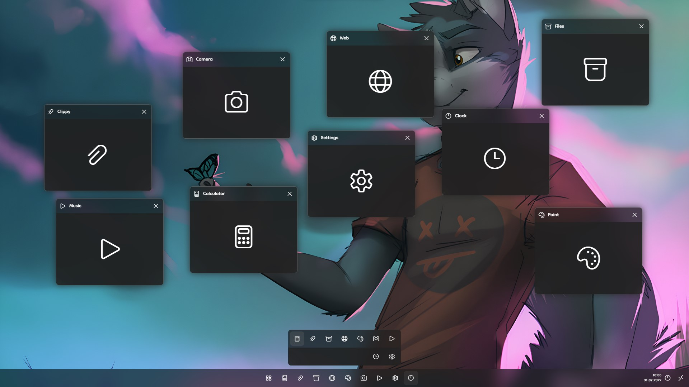

# LUIX




## Libraries

- React
- Emotion
- Lodash
- react-spring
- react-use-system-theme
- react-draggable

## Running this project

1. Install all dependencies.

```sh
yarn
```

2. Start react development server.

```sh
yarn start
```
